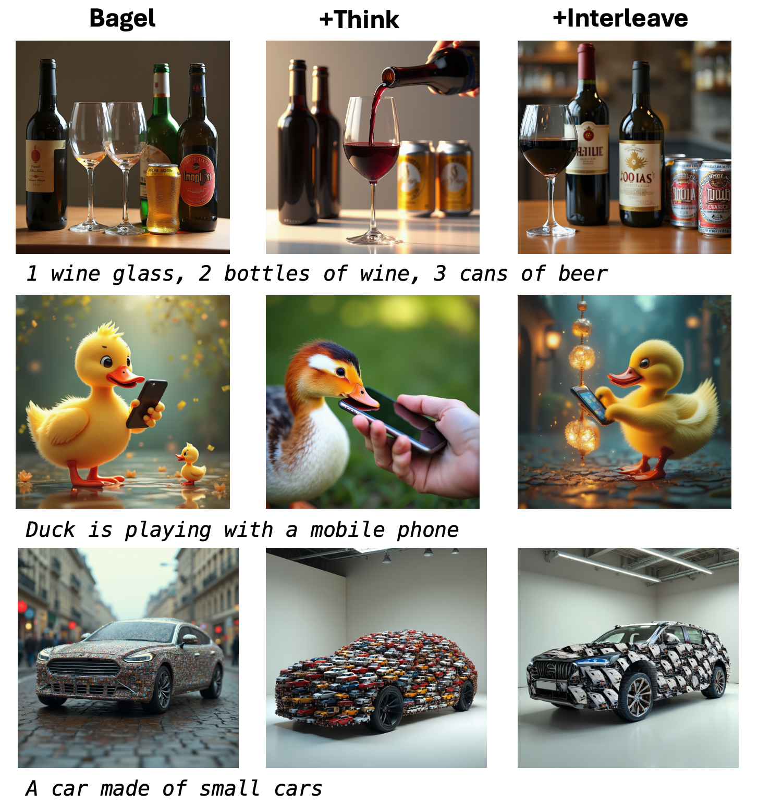

# Bagel-Interleave: 通过交错式图文输入增强统一多模态模型

本项目探索并实现了一个基于统一多模态模型（Unified Multimodal Model, UMM）的增强框架。核心特性在于模型能够利用其内在的理解能力，通过“思考”过程优化生成效果，并支持交错式的文本与图像输入，实现多轮次、迭代式的输出而提升生成效果。

### 1. 以“思考”提升生成质量

传统的文本到图像生成模型直接将文本提示映射为视觉输出。本项目中的模型引入了一个“思考”阶段：在生成图像之前，模型会首先产出一段内部的规划或推理过程（即“Think”）。这个过程帮助模型更深刻地理解用户意图，拆解复杂概念，从而生成与文本描述更一致、细节更丰富、逻辑性更强的图像。这种机制模拟了人类的创作思维，即先构思后创作，显著提升了生成的可控性和准确性。

### 2. 支持交错式图文输入

本模型具备处理交错文本和图像序列的能力。用户可以提供一个文本提示，模型生成一张图片；接着，用户可以基于生成的图片提供新的文本指令，模型会理解上下文并进行再次生成。这种多模态、多轮次的交互方式打破了单次“文本-图像”生成的局限，为更复杂的创作生成任务（如故事可视化、逐步设计修改）提供了可能。

### 3. 自我迭代的生成闭环

结合以上两点，模型能够实现一种自我迭代和优化的生成闭环。具体而言，模型可以生成一张初始图像，然后将该图像作为新的视觉输入，结合新的文本指令进行“思考”和再创作。这个过程可以重复多次，每一轮迭代都是对前一轮结果的审视、理解和优化。这种能力使得模型能够完成渐进式的、需要上下文依赖的复杂视觉任务，展现了其作为高级创作助手的潜力。

## 🚀 Quick Start

1️⃣ 创建环境：

```bash
git clone https://github.com/LanDisen/Bagel-Interleave.git
cd Bagel-Interleave
conda create -n bagel-interleave python=3.10 -y
conda activate bagel-interleave
pip install -r requirements.txt
pip install flash_attn==2.5.8 --no-build-isolation
```

2️⃣ 下载Bagel模型：

```bash
python download_model.py
```

3️⃣ 运行推理脚本：

```bash
python inference.py
```

## Results

一下结果直观地展示了“思考”（Think）和“交错”（Interleave）两种机制对统一多模态模型（UMM）生成能力的显著提升。

-   **基线生成 (Baseline)**: 标准的文本到图像生成结果，可能存在与提示不完全匹配的问题。
-   **带“思考”的生成 (Think)**: 在生成前进行内部规划，使得图像更准确地反映了文本提示的复杂细节和逻辑关系。
-   **交错式生成 (Interleave)**: 通过多轮图文输入，模型能够逐步优化和迭代，最终生成更符合用户连续指令的、高质量的图像。

